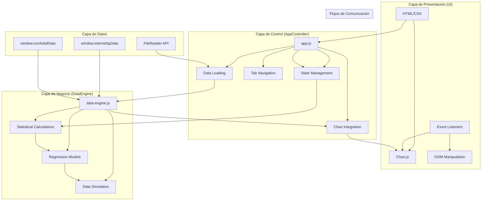

# Arquitectura de Aether Analytics

## 1. Diagrama de Arquitectura General



## 2. Flujo de Datos

### Carga de Datos
1. **Datos Internship (SAAS)**: Cargados desde `window.internshipData` (array de objetos con estudiantes)
2. **Datos Nordvital (E-commerce)**: Cargados desde `window.nordvitalData` (array de objetos con citas médicas)
3. **Datos CSV Personalizados**: 
   - Usuario arrastra archivo CSV al dropzone
   - `FileReader API` lee el archivo como texto
   - `parseCSVText()` parsea el texto a objetos JSON
   - Datos almacenados en `state.customData.rows`

### Procesamiento de Datos
```
Datos Crudos → DataEngine → Métricas Calculadas → UI Renderizado
```

**Flujo detallado:**
1. Datos crudos se cargan en el estado global
2. `DataEngine` calcula métricas estadísticas (media, desviación estándar, regresión)
3. Resultados se pasan a `AppController` para renderizado
4. UI actualiza DOM con valores formateados y gráficos

### Visualización
- **Chart.js** recibe datos estructurados desde `AppController`
- Gráficos se actualizan en tiempo real mediante `chart.update()`
- Gráficos existentes se redimensionan con `chart.resize()` al cambiar de pestaña

## 3. Componentes Principales

### DataEngine (`data-engine.js`)
Motor de procesamiento estadístico y modelos predictivos.

**Funcionalidades:**
- `calculateMean(arr)`: Calcula media aritmética
- `calculateStandardDeviation(arr, mean)`: Calcula desviación estándar
- `calculateLinearRegression(y)`: Regresión lineal simple (y = mx + b)
- `calculateMultipleLinearRegression()`: Regresión múltiple (eliminación Gaussiana)
- `getSelectionAttributeComparison()`: Compara atributos entre seleccionados/rechazados
- `generateEcomData()`: Genera datos simulados con estacionalidad
- `generateEcomForecast()`: Proyecta ventas futuras con modificador de crecimiento

**Estructura:**
```javascript
class DataEngine {
  // Métodos estadísticos
  calculateMean()
  calculateStandardDeviation()
  calculateLinearRegression()
  calculateMultipleLinearRegression()
  
  // Simulación y predicción
  getSelectionAttributeComparison()
  generateEcomData()
  generateEcomForecast()
}
```

### AppController (`app.js`)
Controlador principal que gestiona UI, navegación y renderizado.

**Funcionalidades:**
- Gestión de pestañas (SAAS, E-commerce, CSV)
- Integración con Chart.js (5 gráficos)
- Renderizado de tablas con paginación
- Manejo de filtros interactivos
- Carga de archivos CSV

**Estructura:**
```javascript
const state = {
  activeTab: 'tab-saas',
  saasData: [],
  ecomData: [],
  customData: { /* estructura de datos personalizada */ },
  charts: { /* referencias a Chart.js instances */ }
};

const engine = new DataEngine();
```

### Filtros y Búsqueda
**Filtros de Nordvital:**
- Fecha (desde/hasta)
- Tipo de cita
- Médico (ID y nombre)
- Especialidad

**Búsqueda:**
- Búsqueda por texto completo en registros
- Filtrado en tiempo real con `input` event listener

### Visualizaciones (Chart.js)
**Gráficos implementados:**
1. `chart-saas-history`: Barra comparativa (Seleccionados vs Rechazados)
2. `chart-saas-forecast`: Barra predictiva con sliders
3. `chart-ecom-sales-forecast`: Línea de tendencia temporal
4. `chart-ecom-channels`: Donut de distribución por tipo
5. `chart-ecom-products`: Barra horizontal Top 10 médicos

## 4. Estructura de Datos

### Estado Global
```javascript
const state = {
  // Navegación
  activeTab: 'tab-saas',
  
  // Datos SAAS (Selección de Internos)
  saasData: [ /* array de objetos estudiante */ ],
  
  // Datos E-commerce (Nordvital)
  ecomData: [ /* array de objetos cita */ ],
  
  // Datos CSV Personalizado
  customData: {
    headers: ['Mes', 'MRR', 'Usuarios Activos', ...],
    rows: [ /* array de objetos */ ],
    filteredRows: [ /* array filtrado */ ],
    currentPage: 1,
    rowsPerPage: 10
  },
  
  // Referencias a gráficos Chart.js
  charts: {
    saasHistory: null,
    saasForecast: null,
    ecomForecast: null,
    ecomChannels: null,
    ecomProducts: null
  }
};
```

### Objeto de Estado para Filtros Nordvital
```javascript
state.nordvitalFilters = {
  dateFrom: '',
  dateTo: '',
  tipoCita: '',
  medico: '',
  medicoNombre: '',
  medicoEspecialidad: '',
  filteredData: [...nordvitalData],
  currentPage: 1,
  rowsPerPage: 10
};
```

## 5. Flujo de Eventos

### DOMContentLoaded
```javascript
document.addEventListener('DOMContentLoaded', () => {
  const engine = new DataEngine();
  const state = { /* inicialización de estado */ };
  
  // Inicializar todas las secciones
  initSaaSSection();
  initEcomSection();
});
```

### Event Listeners Principales

**Navegación:**
```javascript
navItems.forEach(item => {
  item.addEventListener('click', () => {
    const targetTab = item.getAttribute('data-tab');
    // Cambiar pestaña y actualizar UI
  });
});
```

**Filtros Nordvital:**
```javascript
document.getElementById('filter-tipo-cita').addEventListener('change', (e) => {
  state.nordvitalFilters.tipoCita = e.target.value;
  applyNordvitalFilters();
});
```

**Carga de Archivos CSV:**
```javascript
csvDropzone.addEventListener('drop', (e) => {
  e.preventDefault();
  const files = e.dataTransfer.files;
  if (files.length > 0) {
    processCSVFile(files[0]);
  }
});
```

**Sliders Predictivos:**
```javascript
sliderGrowth.addEventListener('input', updateSaaSProbability);
sliderChurn.addEventListener('input', updateSaaSProbability);
sliderCoding.addEventListener('input', updateSaaSProbability);
```

## 6. Dependencias

### Librerías Externas
- **Chart.js**: CDN `https://cdn.jsdelivr.net/npm/chart.js`
  - Usado para todas las visualizaciones
  - Configuración personalizada con temas oscuros
  
### APIs del Navegador
- **FileReader API**: Carga de archivos CSV locales
- **localStorage**: No implementado actualmente

### Módulos Propios
- `data-engine.js`: Motor estadístico
- `nordvital-data.js`: Datos simulados E-commerce
- `dataset-data.js`: Datos simulados SAAS
- `app.js`: Controlador principal

## 7. Patrones de Diseño

### MVC Simplificado
```
Model (DataEngine)
  ↓
View (DOM + Chart.js)
  ↑
Controller (AppController)
```

### Estado Centralizado
- Todo el estado se mantiene en un objeto `state`
- Mutaciones del estado desencadenan actualizaciones de UI
- Patrón similar a Redux pero sin framework

### Patrón Observer (Chart.js)
- Gráficos se actualizan mediante callbacks
- `chart.update()` notifica cambios de datos

### Patrón Factory (DataEngine)
- `calculateMultipleLinearRegression()` implementa algoritmo específico
- Encapsula lógica compleja en métodos de clase

## 8. Flujos de Negocio

### Carga de Datos desde CSV
```
1. Usuario arrastra archivo CSV
   ↓
2. FileReader API lee archivo como texto
   ↓
3. parseCSVText() parsea texto a objetos JSON
   ↓
4. Datos almacenados en state.customData
   ↓
5. renderCSVAnalysis() muestra estadísticas
```

### Aplicación de Filtros
```
1. Usuario selecciona filtro (fecha, tipo, médico, etc.)
   ↓
2. applyNordvitalFilters() filtra array completo
   ↓
3. state.nordvitalFilters.filteredData actualizado
   ↓
4. updateNordvitalMetrics() recalcula KPIs
   ↓
5. updateNordvitalCharts() actualiza gráficos
   ↓
6. renderNordvitalTable() renderiza tabla paginada
```

### Cálculo de Métricas
```
1. DataEngine recibe array de datos
   ↓
2. calculateMean() calcula promedios por atributo
   ↓
3. calculateMultipleLinearRegression() calcula coeficientes
   ↓
4. Resultados devueltos a AppController
   ↓
5. UI actualiza tarjetas KPI con valores formateados
```

### Renderizado de Gráficos
```
1. AppController recibe datos procesados
   ↓
2. new Chart() o chart.update() inicializa/actualiza gráfico
   ↓
3. Configuración con colores personalizados
   ↓
4. Gráfico renderizado en canvas
```

## 9. Consideraciones de Rendimiento

### Paginación
- **Implementación**: Filtrado en cliente con `slice()`
- **Ventaja**: Menor carga inicial de DOM
- **Limitación**: Filtrado completo en memoria antes de paginar

### Filtrado en Cliente
- **Implementación**: `array.filter()` en cada evento
- **Rendimiento**: O(n) por evento, problemático con datasets > 10,000 registros
- **Optimización sugerida**: Filtrado en servidor o IndexedDB

### Renderizado de Tablas
- **Implementación**: `innerHTML` con template strings
- **Optimización**: Considerar virtualización para datasets grandes

### Cálculos Estadísticos
- **Implementación**: O(n²) para regresión múltiple
- **Limitación**: Datasets > 1,000 registros pueden ser lentos
- **Optimización**: Muestreo de datos o algoritmos aproximados

### Gráficos Chart.js
- **Optimización**: `maintainAspectRatio: false` para responsividad
- **Optimización**: `responsive: true` para redimensionamiento automático

## 10. Puntos de Mejora

### Virtualización
```javascript
// Implementación sugerida
const VirtualTable = {
  renderRow(index) {
    // Renderizar solo fila visible
  },
  scrollTo(index) {
    // Scroll al índice deseado
  }
};
```

### Caching
```javascript
// Cache de resultados estadísticos
const cache = new Map();
const cachedStats = cache.get('saas-stats');

if (cachedStats) {
  return cachedStats;
}
// Calcular y guardar
cache.set('saas-stats', stats);
```

### Optimización de Cálculos
```javascript
// Muestreo para regresión
const sampleSize = Math.min(data.length, 1000);
const sampledData = data.slice(0, sampleSize);
const result = engine.calculateMultipleLinearRegression(sampledData);
```

### IndexedDB para Datos Grandes
```javascript
// Almacenamiento persistente
const db = await openDB('aether-analytics', 1);
const transaction = db.transaction(['data'], 'readwrite');
// Guardar/cargar datos en IndexedDB
```

### Web Workers para Cálculos Pesados
```javascript
// Ejecutar cálculos en hilo separado
const worker = new Worker('stats-worker.js');
worker.postMessage(data);
worker.onmessage = (e) => {
  const stats = e.data;
  updateUI(stats);
};
```

---

*Documento generado para Aether Analytics - Plataforma de Ingeniería y Pronóstico de Datos*
